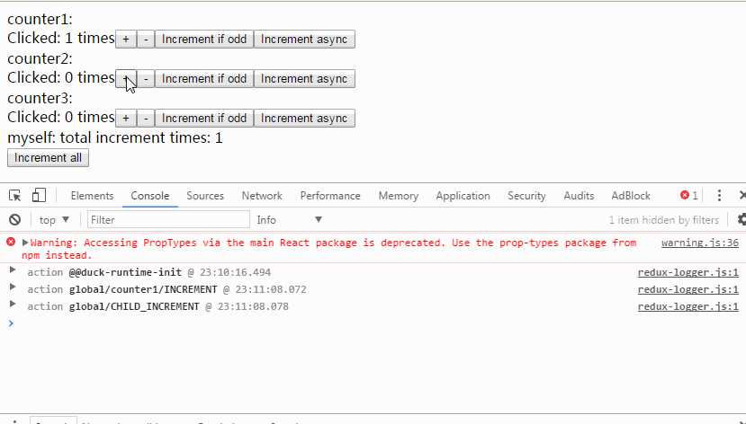

# saga-duck
extensible and composable duck for redux-saga

See also
[ducks-modular-redux](https://github.com/erikras/ducks-modular-redux)
[extensible-duck](https://github.com/investtools/extensible-duck)

# example


# usage
## install
```sh
npm i saga-duck -S
```

## Documents
[Document-中文](https://cyrilluce.gitbooks.io/saga-duck)

## memtion
Ducks should be stateless, so we can use React FSC(functional stateless compoment) and optimize later.
You should only access store by duck.selector or duck.selectors.

## single duck
```js
import { Duck } from "saga-duck";
import { takeEvery, call, put, select } from "redux-saga/effects";
import { delay } from "redux-saga";

export default class MyDuck extends Duck {
  constructor() {
    super(
      {
        /** actionTypes */
        typeList: [
          "INCREMENT",
          "INCREMENT_IF_ODD",
          "DECREMENT",
          "INCREMENT_ASYNC"
        ],
        /** single reducer */
        reducer: (state = 0, action, duck) => {
          const { types } = duck;
          switch (action.type) {
            case types.INCREMENT:
              return state + (action.step || 1);
            case types.INCREMENT_IF_ODD:
              return state % 2 !== 0 ? state + 1 : state;
            case types.DECREMENT:
              return state - 1;
            default:
              return state;
          }
        },
        /** extensible reducers */
        // reducers: ({types})=({ count: (state=0, action)=>... })
        /** selectors, will auto map current duck's state */
        selectors: {
          count: state => state
        },
        /** action creators */
        creators: ({ types }) => ({
          increment: step => ({ type: types.INCREMENT, step }),
          incrementIfOdd: () => ({ type: types.INCREMENT_IF_ODD }),
          decrement: () => ({ type: types.DECREMENT }),
          incrementAsync: () => ({ type: types.INCREMENT_ASYNC })
        }),
        /** custom options */
        step: 1,
        // getStep: () => 1,

        /** sagas */
        sagas: [
          function*({
            types,
            creators,
            selector,
            selectors,
            options: { step, getStep }
          }) {
            // use types define
            yield takeEvery(types.INCREMENT_ASYNC, function*() {
              yield call(delay, 1000);
              // select state of this duck
              const state = yield select(selector);
              // select some value of this duck
              const currentNumber = yield select(selectors.count);
              // use custom property in options
              const incStep = (getStep && getStep()) || step;
              // use action creators
              yield put(creators.increment(incStep));
            });
          }
        ]
      },
      /** for extensible usage */
      ...arguments
    );
  }
}
```

## extend duck
```js
import { Duck } from "saga-duck";
import Base from "./CounterDuck";

export default class Duck extends Base {
  constructor() {
    super(
      {
        /** custom options will be overwrite */
        step: 10,
        /** merge */
        typeList: ["MORE"],
        /** reducer will overwrite, reducers will merge */
        reducers: duck => ({ more: (state, action) => 1 }),
        /** merge */
        selectors: { more: state => state.more },
        /** merge */
        creators: duck => ({ more: () => ({ type: duck.types.MORE }) }),
        /** merge */
        sagas: [function*() {}]
      },
      ...arguments
    );
  }
}
```

## compose ducks
```js
import { DuckMap } from "saga-duck";
import CounterDuck from "./CounterDuck";

export default class MyRootDuck extends DuckMap {
  constructor() {
    super(
      {
        /** child ducks, { [route]: ChildDuck }, can access by duck.ducks[route] */
        ducks: {
          /** no options */
          counter1: CounterDuck,
          /** copy options.step to child duck */
          counter2: [CounterDuck, "step"],
          /** copy transformed options to child duck */
          counter3: [
            CounterDuck,
            /** DO NOT access duck.ducks here */
            (opts, duck) => ({ getStep: opts.getStep.bind(duck) })
          ]
        },
        /** custom options, can map to child ducks */
        step: 2,
        getStep: () => 3,
        typeList: ["INCREMENT", "CHILD_INCREMENT"],
        /** extensible reducers, child ducks reducer will merge according to route key */
        reducers: ({ types }) => ({
          total: (state = 0, action) => {
            switch (action.type) {
              case types.CHILD_INCREMENT:
                return state + 1;
              default:
                return state;
            }
          }
        }),
        selectors: {
          total: state => state.total
        },
        creators: ({ types }) => ({
          increment: () => ({ type: types.INCREMENT })
        }),
        sagas: [
          function*({ types, ducks: { counter1, counter2, counter3 } }) {
            
          }
        ]
      },
      ...arguments
    );
  }
}
```

## Run and connect to React
```js
import { DuckRuntime } from "saga-duck";
import Root from "./Root";
import Duck from "./RootDuck";

const duckRuntime = new DuckRuntime(new Duck({...}));
const ConnectedComponent = duckRuntime.connectRoot()(Root);

ReactDOM.render(
  <Provider store={duckRuntime.store}>
    <ConnectedComponent />
  </Provider>,
  document.getElementById("root")
);
```

## Typescript support
See [Duck example](./examples/src/CounterDuck.ts) and [DuckMap example](./examples/src/RootDuck.ts)
```typescript
import { Duck } from "../../src";
import { takeEvery, call, put, select } from "redux-saga/effects";
import { delay } from "redux-saga";

type State = number;
enum TYPE{
  INCREMENT,
  INCREMENT_IF_ODD,
  DECREMENT,
  INCREMENT_ASYNC
};
interface Creators{
  increment(step?: number): { type: string; step: number };
}
interface Selectors{
  count: number;
}
interface Options{
  step?: number;
  getStep?: () => number;
}
export default class MyDuck extends Duck<
  State,
  typeof TYPE,
  Creators,
  Selectors,
  Options
> {
  init() {
    super.init();
    this.extend(
      {
        types: TYPE,
        ...
      }
    );
  }
}
```