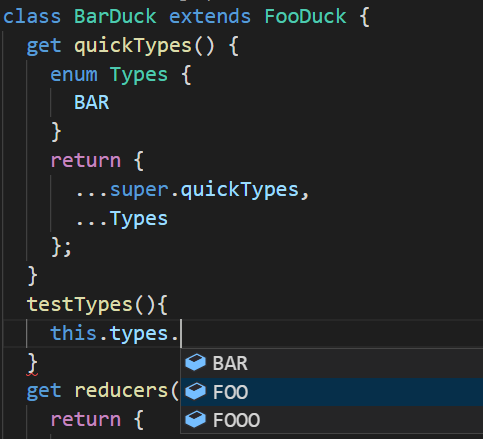
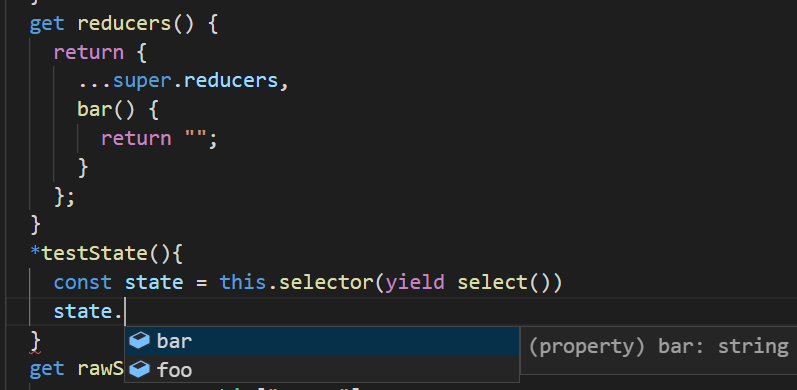

# saga-duck
extensible and composable duck for redux-saga, typescript 3.x supported.

See also
[ducks-modular-redux](https://github.com/erikras/ducks-modular-redux)
[extensible-duck](https://github.com/investtools/extensible-duck)

# example


# usage
## install
```sh
npm i saga-duck -S
```

## Documents
[Document-中文](https://cyrilluce.gitbook.io/saga-duck/)

for 2.x please visit
[Legacy Document-中文](https://cyrilluce.gitbooks.io/saga-duck)


## memtion
Ducks should be stateless, so we can use React FSC(functional stateless compoment) and optimize later.
You should only access store by duck.selector or duck.selectors.

## single duck
```js
import { Duck } from "saga-duck";
import { takeEvery, call, put, select } from "redux-saga/effects";
import { delay } from "redux-saga";

export default class MyDuck extends Duck {
  get quickTypes() {
    return {
      ...super.quickTypes,
      INCREMENT: 1,
      INCREMENT_IF_ODD: 1,
      DECREMENT: 1,
      INCREMENT_ASYNC: 1
    };
  }
  get reducers() {
    const { types } = this;
    return {
      ...super.reducers,
      count: (state = 0, action) => {
        switch (action.type) {
          case types.INCREMENT:
            return state + action.step;
          case types.INCREMENT_IF_ODD:
            return state % 2 !== 0 ? state + action.step : state;
          case types.DECREMENT:
            return state - action.step;
          default:
            return state;
        }
      }
    };
  }
  get rawSelectors() {
    return {
      ...super.rawSelectors,
      count(state) {
        return state.count;
      }
    };
  }
  get creators() {
    const { types, step: defaultStep } = this;
    return {
      ...super.creators,
      increment: (step = defaultStep) => ({
        type: types.INCREMENT,
        step
      }),
      incrementIfOdd: (step = defaultStep) => ({
        type: types.INCREMENT_IF_ODD,
        step
      }),
      decrement: (step = defaultStep) => ({
        type: types.DECREMENT,
        step
      }),
      incrementAsync: () => ({ type: types.INCREMENT_ASYNC })
    };
  }
  get step() {
    return 1;
  }
  *saga() {
    yield* super.saga();
    const { types, selector, selectors, creators, step } = this;
    yield takeEvery(types.INCREMENT_ASYNC, function*() {
      yield call(delay, 1000);
      // select state of this duck
      const state = selector(yield select());
      // select some value of this duck
      const currentNumber = selectors.count(yield select());
      // use custom property in options
      // use action creators
      yield put(creators.increment(step));
    });
  }
}
```

## extend duck
```js
import { Duck } from "saga-duck";
import Base from "./CounterDuck";

export default class Duck extends Base {
  get step(){
    return 10
  }
  get quickTypes(){
    return {
      ...super.quickTypes,
      MORE: 1
    }
  }
  get reducers(){
    return {
      ...super.reducers,
      more: (state, action) => 1
    }
  }
  get rawSelectors(){
    return {
      ...super.rawSelectors,
      more(state){
        return state.more
      }
    }
  }
  get creators(){
    const { types } = this
    return {
      ...super.creators,
      more(){
        return {
          type: types.MORE
        }
      }
    }
  }
}
```

## compose ducks
```js
import { DuckMap } from "saga-duck";
import CounterDuck from "./CounterDuck";

export default class MyRootDuck extends DuckMap{
  get quickTypes(){
    return {
      ...super.quickTypes,
      "INCREMENT": 1, 
      "CHILD_INCREMENT": 1
    }
  }
  get reducers(){
    const {types}=this
    return {
      ...super.reducers,
      total: (state = 0, action) => {
        switch (action.type) {
          case types.CHILD_INCREMENT:
            return state + 1;
          default:
            return state;
        }
      }
    }
  }
  get rawSelectors(){
    return {
      ...super.rawSelectors,
      total: state => state.total
    }
  }
  get creators(){
    return {
      ...super.creators,
      increment: () => ({ type: this.types.INCREMENT })
    }
  }
  get quickDucks(){
    return {
      ...super.quickDucks,
      counter1: CounterDuck,
      counter2: CounterStep2Duck,
      counter3: CounterStep3Duck
    }
  }
  *saga(){
    yield* super.saga()
    const { types, ducks: { counter1, counter2, counter3 } }=this
      // Increment all counters
      yield takeEvery(types.INCREMENT, function*() {
        yield put(counter1.creators.increment());
        yield put(counter2.creators.increment());
        yield put(counter3.creators.increment());
      });

      // Count child counters increments
      yield takeEvery(
        [
          counter1.types.INCREMENT,
          counter2.types.INCREMENT,
          counter3.types.INCREMENT
        ],
        function*() {
          yield put({ type: types.CHILD_INCREMENT });
        }
      );
  }
}
```

## Run and connect to React
```js
import { DuckRuntime } from "saga-duck";
import Root from "./Root";
import Duck from "./RootDuck";

const duckRuntime = new DuckRuntime(new Duck({...}));
const ConnectedComponent = duckRuntime.connectRoot()(Root);

ReactDOM.render(
  <Provider store={duckRuntime.store}>
    <ConnectedComponent />
  </Provider>,
  document.getElementById("root")
);
```

## Helpers
### purify
make React DuckComponent pure, only rerender when props and duck state changed.
```javascript
import { purify } from 'saga-duck'
export default purify(function DuckComponent({ duck, store, dispatch }){ ... })
```

### memorize
stabilize objects/functions reference, prevent React props unnecessary change.
```javascript
import { memorize } from 'saga-duck'
const getHandler = memorize((duck, dispatch) => ()=>dispatch(duck.creators.bar()) )

function Container(props){
  const handler = gethandler(props)
  return <Foo handler={handler} />
}
```

### reduceFromPayload / createToPayload
Create simple reducer / actionCreator
```javascript
import { reduceFromPayload, createToPayload } from 'saga-duck'

let reducer = reduceFromPayload(types.SET_ID, 0)
// equal to 
reducer = (state=0, action)=>{
  switch(action.type){
    case types.SET_ID:
      return action.payload
    default:
      return state
  }
}

let creator = createToPayload<number>(types.SET_ID)
// equal to
creator = (id)=>({ type: types.SET_ID, payload: id })
```

## Typescript support
See [Duck example](./examples/src/CounterDuck.ts) and [DuckMap example](./examples/src/RootDuck.ts), please use typescript **3.0+** for saga-duck 3.x, and typescript 2.6.1 for saga-duck 2.x.
### types


### state (generate from reducers)


### selectors
